# 1. Importing Libraries & Packages 📚📦


```python
import pandas as pd
import numpy as np
import seaborn as sb
import matplotlib.pyplot as plt
import warnings
warnings.filterwarnings('ignore')
```

# 2. Data Import & Preview 📊👀


```python
df= pd.read_csv('salary_data.csv')
df.head()
```


<div>
<style scoped>
    .dataframe tbody tr th:only-of-type {
        vertical-align: middle;
    }

    .dataframe tbody tr th {
        vertical-align: top;
    }

    .dataframe thead th {
        text-align: right;
    }
</style>
<table border="1" class="dataframe">
  <thead>
    <tr style="text-align: right;">
      <th></th>
      <th>Unnamed: 0</th>
      <th>Age</th>
      <th>Gender</th>
      <th>Education Level</th>
      <th>Job Title</th>
      <th>Years of Experience</th>
      <th>Salary</th>
      <th>Country</th>
      <th>Race</th>
    </tr>
  </thead>
  <tbody>
    <tr>
      <th>0</th>
      <td>0</td>
      <td>32.0</td>
      <td>Male</td>
      <td>Bachelor's</td>
      <td>Software Engineer</td>
      <td>5.0</td>
      <td>90000.0</td>
      <td>UK</td>
      <td>White</td>
    </tr>
    <tr>
      <th>1</th>
      <td>1</td>
      <td>28.0</td>
      <td>Female</td>
      <td>Master's</td>
      <td>Data Analyst</td>
      <td>3.0</td>
      <td>65000.0</td>
      <td>USA</td>
      <td>Hispanic</td>
    </tr>
    <tr>
      <th>2</th>
      <td>2</td>
      <td>45.0</td>
      <td>Male</td>
      <td>PhD</td>
      <td>Senior Manager</td>
      <td>15.0</td>
      <td>150000.0</td>
      <td>Canada</td>
      <td>White</td>
    </tr>
    <tr>
      <th>3</th>
      <td>3</td>
      <td>36.0</td>
      <td>Female</td>
      <td>Bachelor's</td>
      <td>Sales Associate</td>
      <td>7.0</td>
      <td>60000.0</td>
      <td>USA</td>
      <td>Hispanic</td>
    </tr>
    <tr>
      <th>4</th>
      <td>4</td>
      <td>52.0</td>
      <td>Male</td>
      <td>Master's</td>
      <td>Director</td>
      <td>20.0</td>
      <td>200000.0</td>
      <td>USA</td>
      <td>Asian</td>
    </tr>
  </tbody>
</table>
</div>


```python
df.drop('Unnamed: 0',axis=1,inplace=True)
```

# 3. Data Summary 📊📋


```python
df.info()
```

    <class 'pandas.core.frame.DataFrame'>
    RangeIndex: 6704 entries, 0 to 6703
    Data columns (total 8 columns):
     #   Column               Non-Null Count  Dtype  
    ---  ------               --------------  -----  
     0   Age                  6702 non-null   float64
     1   Gender               6702 non-null   object 
     2   Education Level      6701 non-null   object 
     3   Job Title            6702 non-null   object 
     4   Years of Experience  6701 non-null   float64
     5   Salary               6699 non-null   float64
     6   Country              6704 non-null   object 
     7   Race                 6704 non-null   object 
    dtypes: float64(3), object(5)
    memory usage: 419.1+ KB
    

### 3.1 So there are 5 categorical columns & 3 numerical columns as specified by the datatype


```python
df.describe().transpose()
```


<div>
<style scoped>
    .dataframe tbody tr th:only-of-type {
        vertical-align: middle;
    }

    .dataframe tbody tr th {
        vertical-align: top;
    }

    .dataframe thead th {
        text-align: right;
    }
</style>
<table border="1" class="dataframe">
  <thead>
    <tr style="text-align: right;">
      <th></th>
      <th>count</th>
      <th>mean</th>
      <th>std</th>
      <th>min</th>
      <th>25%</th>
      <th>50%</th>
      <th>75%</th>
      <th>max</th>
    </tr>
  </thead>
  <tbody>
    <tr>
      <th>Age</th>
      <td>6702.0</td>
      <td>33.620859</td>
      <td>7.614633</td>
      <td>21.0</td>
      <td>28.0</td>
      <td>32.0</td>
      <td>38.0</td>
      <td>62.0</td>
    </tr>
    <tr>
      <th>Years of Experience</th>
      <td>6701.0</td>
      <td>8.094687</td>
      <td>6.059003</td>
      <td>0.0</td>
      <td>3.0</td>
      <td>7.0</td>
      <td>12.0</td>
      <td>34.0</td>
    </tr>
    <tr>
      <th>Salary</th>
      <td>6699.0</td>
      <td>115326.964771</td>
      <td>52786.183911</td>
      <td>350.0</td>
      <td>70000.0</td>
      <td>115000.0</td>
      <td>160000.0</td>
      <td>250000.0</td>
    </tr>
  </tbody>
</table>
</div>


```python
print('Total Rows  : ',df.shape[0] , '\nTotal Columns : ',df.shape[1])
```

    Total Rows  :  6704 
    Total Columns :  8
    

### 3.2 We got the statistics of the numerical columns as well as the shape/size of dataset.

# 4. Data Cleaning 🧹🧼

### 4.1 Checking for missing values & dealing with them accordingly


```python
print(df.isnull().sum())
```

    Age                    2
    Gender                 2
    Education Level        3
    Job Title              2
    Years of Experience    3
    Salary                 5
    Country                0
    Race                   0
    dtype: int64
    


```python
print('The missing values in Age column contributes: {}'.format(round((5/6704) * 100,3))+ '%')
```

    The missing values in Age column contributes: 0.075%
    


```python
print('The % of missing values is very less, so we can drop these rows as they will not effect the dataset')
```

    The % of missing values is very less, so we can drop these rows as they will not effect the dataset
    

### 4.2 Making a generalised function to check for missing values


```python
# Creating a list of columns in the dataset
dataset_columns= list(df.columns)

# Creating a list to store the null value count for each column
null_values=[]
for i in dataset_columns:
    if df[i].isnull().sum() > 0:
        null_values.append(df[i].isnull().sum())
    else:
        null_values.append(0)
        
# making a key-value pair in a dictionary for column names and the missing values
new_dict = dict(zip(dataset_columns,null_values))

#Traversing the dictionary to get the missing values and their percentage
for x,y in new_dict.items():
    if y>0:
        print('The missing values in',x, 'column contributes: {}'.format(round((y/6704) * 100,3))+ '% to data \n')
    else:
        print("No missing values in ",x,'column')
```

    The missing values in Age column contributes: 0.03% to data 
    
    The missing values in Gender column contributes: 0.03% to data 
    
    The missing values in Education Level column contributes: 0.045% to data 
    
    The missing values in Job Title column contributes: 0.03% to data 
    
    The missing values in Years of Experience column contributes: 0.045% to data 
    
    The missing values in Salary column contributes: 0.075% to data 
    
    No missing values in  Country column
    No missing values in  Race column
    

### As the percentage of missing values is very less , dropping these rows won't affect the dataset. Therefore, we can drop these empty rows


```python
df.head()
```


<div>
<style scoped>
    .dataframe tbody tr th:only-of-type {
        vertical-align: middle;
    }

    .dataframe tbody tr th {
        vertical-align: top;
    }

    .dataframe thead th {
        text-align: right;
    }
</style>
<table border="1" class="dataframe">
  <thead>
    <tr style="text-align: right;">
      <th></th>
      <th>Age</th>
      <th>Gender</th>
      <th>Education Level</th>
      <th>Job Title</th>
      <th>Years of Experience</th>
      <th>Salary</th>
      <th>Country</th>
      <th>Race</th>
    </tr>
  </thead>
  <tbody>
    <tr>
      <th>0</th>
      <td>32.0</td>
      <td>Male</td>
      <td>Bachelor's</td>
      <td>Software Engineer</td>
      <td>5.0</td>
      <td>90000.0</td>
      <td>UK</td>
      <td>White</td>
    </tr>
    <tr>
      <th>1</th>
      <td>28.0</td>
      <td>Female</td>
      <td>Master's</td>
      <td>Data Analyst</td>
      <td>3.0</td>
      <td>65000.0</td>
      <td>USA</td>
      <td>Hispanic</td>
    </tr>
    <tr>
      <th>2</th>
      <td>45.0</td>
      <td>Male</td>
      <td>PhD</td>
      <td>Senior Manager</td>
      <td>15.0</td>
      <td>150000.0</td>
      <td>Canada</td>
      <td>White</td>
    </tr>
    <tr>
      <th>3</th>
      <td>36.0</td>
      <td>Female</td>
      <td>Bachelor's</td>
      <td>Sales Associate</td>
      <td>7.0</td>
      <td>60000.0</td>
      <td>USA</td>
      <td>Hispanic</td>
    </tr>
    <tr>
      <th>4</th>
      <td>52.0</td>
      <td>Male</td>
      <td>Master's</td>
      <td>Director</td>
      <td>20.0</td>
      <td>200000.0</td>
      <td>USA</td>
      <td>Asian</td>
    </tr>
  </tbody>
</table>
</div>


```python
df = df.dropna()
```


```python
df.isnull().sum()
```


    Age                    0
    Gender                 0
    Education Level        0
    Job Title              0
    Years of Experience    0
    Salary                 0
    Country                0
    Race                   0
    dtype: int64


# 5 Exploratory Data Analysis (EDA) 🔍📊

### 5.1 Let's start by exploring the distribution of salary range in the dataset


```python
plt.hist(df['Salary'], bins=20, edgecolor='black')
plt.xlabel('Salary Range')
plt.ylabel('Frequency')
plt.title("Distribution of Salary")
plt.show()
```


    
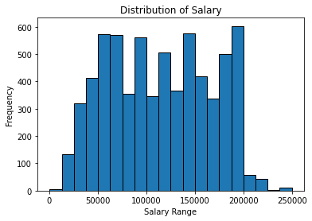
    


### 5.2 Relationship between Age & Salary of a person


```python
sb.lineplot(data = df, x= 'Age', y = 'Salary');
```


    
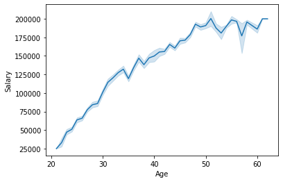
    


### 5.3 Salary distribution across the Age Range derived from Age column


```python
bins = [0, 18, 30, 50, float('inf')]  # Define your age range bins
labels = ['0-18', '19-30', '31-50', '51+']  # Labels for the age ranges

# Create the 'AgeRange' column using pd.cut()
df['AgeRange'] = pd.cut(df['Age'], bins=bins, labels=labels)

sb.barplot(data = df , x= 'AgeRange' , y='Salary');
```


    
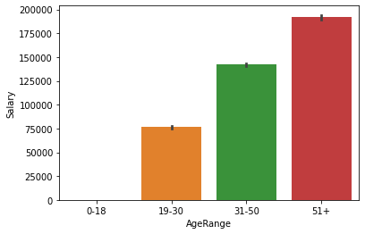
    


### 5.4 Relationship of Gender and Salary


```python
gender_salary = df.groupby('Gender')[['Salary']].mean()

plt.figure(figsize = (10,6))
sb.barplot(data= gender_salary, x=gender_salary.index, y = 'Salary');
```


    
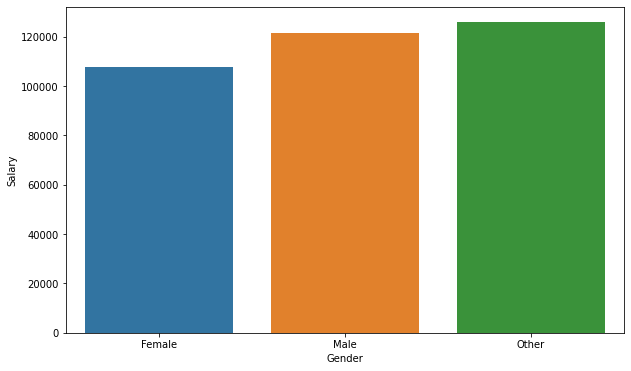
    


### 5.5 Relationship of Education Level and Salary


```python
df['Education Level'] = df['Education Level'].replace({"Bachelor's Degree":"Bachelor's","Master's Degree":"Master's",'phD':'PhD'})
salary_education = df.groupby('Education Level')[['Salary']].mean().sort_index()
sb.barplot(data= salary_education,x = salary_education.index, y = 'Salary');
```


    
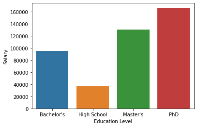
    


### 5.6 let's explore the role of Gender in Education level and their salaries


```python
plt.figure(figsize=(10,8))
sb.barplot(data= df,x = df['Education Level'], y = df['Salary'], hue= 'Gender');
```


    
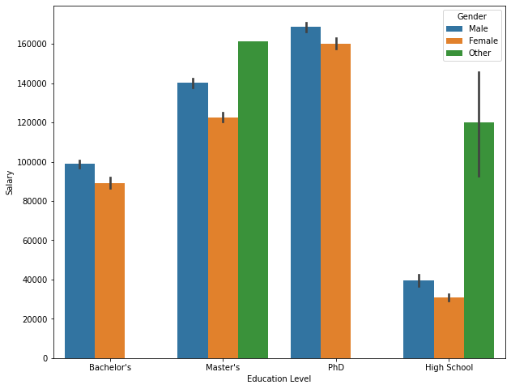
    


### 5.7 Let's find the top 10 highest paying job titles


```python
#Data derivation
job_salary = df.groupby('Job Title')[['Salary']].mean().sort_index()
top_10_highest_paying_job_title = job_salary.nlargest(10,'Salary')

#PLotting
plt.figure(figsize = (20,8))
sb.barplot( data = top_10_highest_paying_job_title, x = top_10_highest_paying_job_title.index, y= 'Salary')
plt.xlabel('Job Title',size =20)
plt.ylabel('Salary',size =20)

plt.show()
```


    
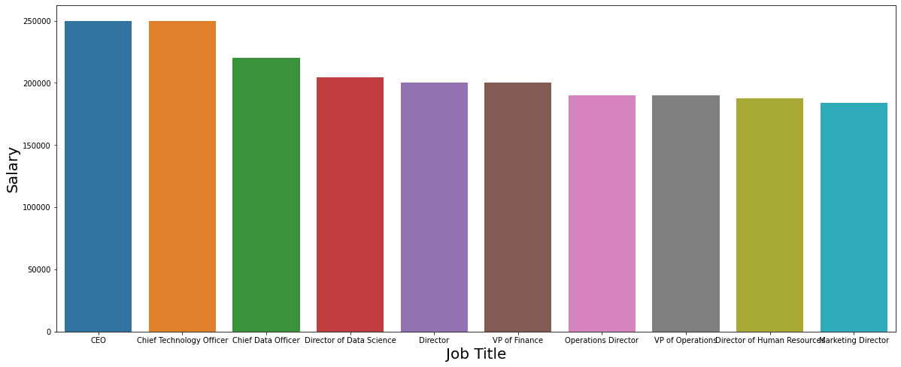
    


### 5.8 let's find the bottom 10 least paying job titles


```python
bottom_10_job_titles = job_salary.nsmallest(10, 'Salary')
plt.figure(figsize = (25,8))
sb.barplot(data = bottom_10_job_titles, x= bottom_10_job_titles.index, y= 'Salary')
plt.xlabel('Job Title',size =20)
plt.ylabel('Salary',size =20)
plt.show()
```


    
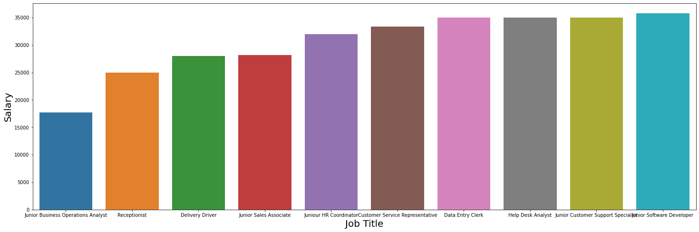
    


### 5.9 let' see which country is earning more salary 


```python
country_salary = df.groupby('Country')[['Salary']].mean().sort_index()

plt.figure(figsize = (10,8))
sb.barplot(data = country_salary, x= country_salary.index, y= 'Salary')
plt.xlabel('Country',size =15)
plt.ylabel('Salary',size =15)
plt.show()
```


    
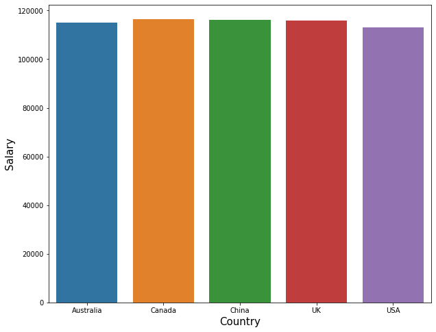
    


### 5.10 Relation between the race and salary


```python
race_salary = df.groupby('Race')[['Salary']].mean()

plt.figure(figsize = (10,8))
sb.barplot(data  = race_salary , x =race_salary.index , y= 'Salary');
```


    
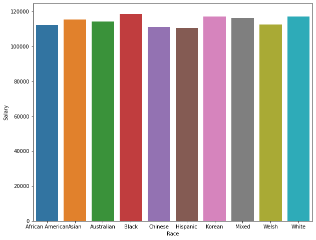
    


### 5.11 Relation between salary & years of expereince


```python
plt.figure(figsize=(10,8))
sb.lineplot(data= df , x= df['Years of Experience'] ,y =df['Salary'], color = 'red');
```


    
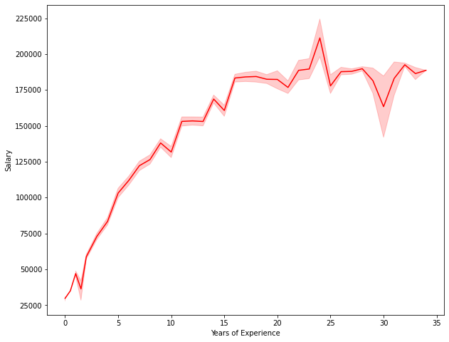
    


### 5.12 Let's find the top 5 highest paying job titles and their Gender distribution


```python
job_titles_salary = df.groupby(['Job Title','Gender'])[['Salary']].mean().reset_index()
top_5 = job_titles_salary.nlargest(5,'Salary').reset_index(drop=True)

plt.figure(figsize=(10,8))
sb.barplot(data = top_5 , x= 'Job Title', y= 'Salary',hue='Gender');
```


    
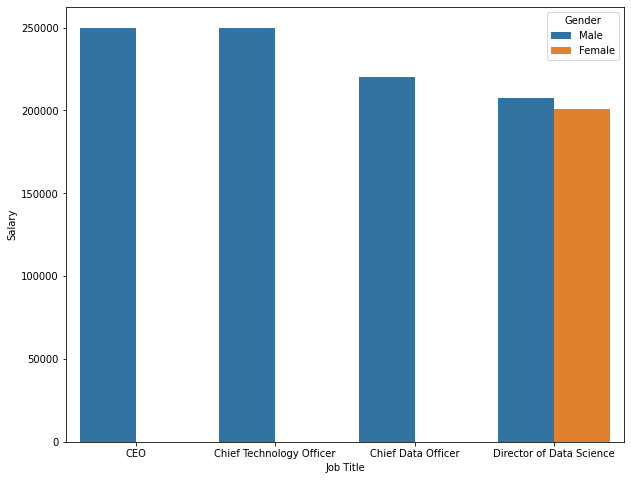
    


### 5.13 Relationship between Race and Salary with respect to Education Level


```python
education_gender= df.groupby(['Education Level','Race'])[['Salary']].mean().reset_index()

plt.figure(figsize=(15,8))
sb.barplot(data = education_gender, x='Race', y='Salary',hue ='Education Level');
```


    
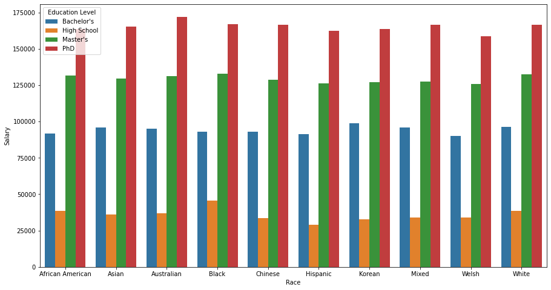
    


# 6. Dataset Preparation 📁🔧


```python
df.head()
```


<div>
<style scoped>
    .dataframe tbody tr th:only-of-type {
        vertical-align: middle;
    }

    .dataframe tbody tr th {
        vertical-align: top;
    }

    .dataframe thead th {
        text-align: right;
    }
</style>
<table border="1" class="dataframe">
  <thead>
    <tr style="text-align: right;">
      <th></th>
      <th>Age</th>
      <th>Gender</th>
      <th>Education Level</th>
      <th>Job Title</th>
      <th>Years of Experience</th>
      <th>Salary</th>
      <th>Country</th>
      <th>Race</th>
      <th>AgeRange</th>
    </tr>
  </thead>
  <tbody>
    <tr>
      <th>0</th>
      <td>32.0</td>
      <td>Male</td>
      <td>Bachelor's</td>
      <td>Software Engineer</td>
      <td>5.0</td>
      <td>90000.0</td>
      <td>UK</td>
      <td>White</td>
      <td>31-50</td>
    </tr>
    <tr>
      <th>1</th>
      <td>28.0</td>
      <td>Female</td>
      <td>Master's</td>
      <td>Data Analyst</td>
      <td>3.0</td>
      <td>65000.0</td>
      <td>USA</td>
      <td>Hispanic</td>
      <td>19-30</td>
    </tr>
    <tr>
      <th>2</th>
      <td>45.0</td>
      <td>Male</td>
      <td>PhD</td>
      <td>Senior Manager</td>
      <td>15.0</td>
      <td>150000.0</td>
      <td>Canada</td>
      <td>White</td>
      <td>31-50</td>
    </tr>
    <tr>
      <th>3</th>
      <td>36.0</td>
      <td>Female</td>
      <td>Bachelor's</td>
      <td>Sales Associate</td>
      <td>7.0</td>
      <td>60000.0</td>
      <td>USA</td>
      <td>Hispanic</td>
      <td>31-50</td>
    </tr>
    <tr>
      <th>4</th>
      <td>52.0</td>
      <td>Male</td>
      <td>Master's</td>
      <td>Director</td>
      <td>20.0</td>
      <td>200000.0</td>
      <td>USA</td>
      <td>Asian</td>
      <td>51+</td>
    </tr>
  </tbody>
</table>
</div>


```python
df = df.drop('AgeRange',axis=1)
```


```python
X = df.drop(columns = ['Salary'])
Y = df['Salary']
```

### 6.1 Splitting the dataset into Train & Test data


```python
from sklearn.model_selection import train_test_split

X_train, X_test, Y_train,Y_test = train_test_split(X,Y,random_state = 2,test_size=0.3)
```

### 6.2 Dealing with the categorical values in the dataframe using OneHot Encoder


```python
from sklearn.preprocessing import OneHotEncoder
encoder = OneHotEncoder(handle_unknown='ignore')
```


```python
X_train
```


<div>
<style scoped>
    .dataframe tbody tr th:only-of-type {
        vertical-align: middle;
    }

    .dataframe tbody tr th {
        vertical-align: top;
    }

    .dataframe thead th {
        text-align: right;
    }
</style>
<table border="1" class="dataframe">
  <thead>
    <tr style="text-align: right;">
      <th></th>
      <th>Age</th>
      <th>Gender</th>
      <th>Education Level</th>
      <th>Job Title</th>
      <th>Years of Experience</th>
      <th>Country</th>
      <th>Race</th>
    </tr>
  </thead>
  <tbody>
    <tr>
      <th>1935</th>
      <td>33.0</td>
      <td>Female</td>
      <td>Bachelor's</td>
      <td>Full Stack Engineer</td>
      <td>7.0</td>
      <td>Canada</td>
      <td>Asian</td>
    </tr>
    <tr>
      <th>499</th>
      <td>33.0</td>
      <td>Male</td>
      <td>PhD</td>
      <td>Data Scientist</td>
      <td>8.0</td>
      <td>UK</td>
      <td>Mixed</td>
    </tr>
    <tr>
      <th>851</th>
      <td>27.0</td>
      <td>Male</td>
      <td>Bachelor's</td>
      <td>Software Engineer</td>
      <td>4.0</td>
      <td>USA</td>
      <td>African American</td>
    </tr>
    <tr>
      <th>6054</th>
      <td>36.0</td>
      <td>Female</td>
      <td>PhD</td>
      <td>Research Scientist</td>
      <td>13.0</td>
      <td>Australia</td>
      <td>White</td>
    </tr>
    <tr>
      <th>4733</th>
      <td>35.0</td>
      <td>Male</td>
      <td>PhD</td>
      <td>Senior Research Scientist</td>
      <td>10.0</td>
      <td>UK</td>
      <td>White</td>
    </tr>
    <tr>
      <th>...</th>
      <td>...</td>
      <td>...</td>
      <td>...</td>
      <td>...</td>
      <td>...</td>
      <td>...</td>
      <td>...</td>
    </tr>
    <tr>
      <th>6448</th>
      <td>35.0</td>
      <td>Female</td>
      <td>PhD</td>
      <td>Senior Product Marketing Manager</td>
      <td>9.0</td>
      <td>UK</td>
      <td>Welsh</td>
    </tr>
    <tr>
      <th>3610</th>
      <td>27.0</td>
      <td>Female</td>
      <td>High School</td>
      <td>Junior HR Generalist</td>
      <td>1.0</td>
      <td>USA</td>
      <td>Asian</td>
    </tr>
    <tr>
      <th>5709</th>
      <td>36.0</td>
      <td>Female</td>
      <td>PhD</td>
      <td>Research Scientist</td>
      <td>12.0</td>
      <td>Australia</td>
      <td>Asian</td>
    </tr>
    <tr>
      <th>6643</th>
      <td>49.0</td>
      <td>Female</td>
      <td>PhD</td>
      <td>Director of Marketing</td>
      <td>20.0</td>
      <td>Canada</td>
      <td>Black</td>
    </tr>
    <tr>
      <th>2578</th>
      <td>26.0</td>
      <td>Male</td>
      <td>Master's</td>
      <td>Full Stack Engineer</td>
      <td>4.0</td>
      <td>Australia</td>
      <td>Asian</td>
    </tr>
  </tbody>
</table>
<p>4688 rows × 7 columns</p>
</div>


```python
X_test
```


<div>
<style scoped>
    .dataframe tbody tr th:only-of-type {
        vertical-align: middle;
    }

    .dataframe tbody tr th {
        vertical-align: top;
    }

    .dataframe thead th {
        text-align: right;
    }
</style>
<table border="1" class="dataframe">
  <thead>
    <tr style="text-align: right;">
      <th></th>
      <th>Age</th>
      <th>Gender</th>
      <th>Education Level</th>
      <th>Job Title</th>
      <th>Years of Experience</th>
      <th>Country</th>
      <th>Race</th>
    </tr>
  </thead>
  <tbody>
    <tr>
      <th>5879</th>
      <td>28.0</td>
      <td>Female</td>
      <td>Bachelor's</td>
      <td>Marketing Coordinator</td>
      <td>3.0</td>
      <td>UK</td>
      <td>Asian</td>
    </tr>
    <tr>
      <th>275</th>
      <td>38.0</td>
      <td>Female</td>
      <td>Bachelor's</td>
      <td>Senior Project Manager</td>
      <td>9.0</td>
      <td>UK</td>
      <td>Asian</td>
    </tr>
    <tr>
      <th>3322</th>
      <td>25.0</td>
      <td>Female</td>
      <td>Master's</td>
      <td>Software Engineer</td>
      <td>2.0</td>
      <td>Canada</td>
      <td>Black</td>
    </tr>
    <tr>
      <th>1762</th>
      <td>35.0</td>
      <td>Male</td>
      <td>Bachelor's</td>
      <td>Back end Developer</td>
      <td>8.0</td>
      <td>USA</td>
      <td>African American</td>
    </tr>
    <tr>
      <th>1567</th>
      <td>43.0</td>
      <td>Male</td>
      <td>PhD</td>
      <td>Senior Project Engineer</td>
      <td>13.0</td>
      <td>China</td>
      <td>White</td>
    </tr>
    <tr>
      <th>...</th>
      <td>...</td>
      <td>...</td>
      <td>...</td>
      <td>...</td>
      <td>...</td>
      <td>...</td>
      <td>...</td>
    </tr>
    <tr>
      <th>2119</th>
      <td>36.0</td>
      <td>Male</td>
      <td>Bachelor's</td>
      <td>Software Engineer Manager</td>
      <td>8.0</td>
      <td>USA</td>
      <td>African American</td>
    </tr>
    <tr>
      <th>638</th>
      <td>28.0</td>
      <td>Male</td>
      <td>Bachelor's</td>
      <td>Software Engineer</td>
      <td>5.0</td>
      <td>Canada</td>
      <td>Black</td>
    </tr>
    <tr>
      <th>2074</th>
      <td>30.0</td>
      <td>Female</td>
      <td>Master's</td>
      <td>Front end Developer</td>
      <td>5.0</td>
      <td>China</td>
      <td>White</td>
    </tr>
    <tr>
      <th>5618</th>
      <td>30.0</td>
      <td>Female</td>
      <td>Bachelor's</td>
      <td>Marketing Coordinator</td>
      <td>5.0</td>
      <td>Canada</td>
      <td>Asian</td>
    </tr>
    <tr>
      <th>5442</th>
      <td>22.0</td>
      <td>Female</td>
      <td>High School</td>
      <td>Receptionist</td>
      <td>0.0</td>
      <td>Canada</td>
      <td>Asian</td>
    </tr>
  </tbody>
</table>
<p>2010 rows × 7 columns</p>
</div>


### 6.3 Encoding the categorical values in Training Dataset.


```python
X_train_cat_encoded = encoder.fit_transform(X_train[['Gender','Job Title','Education Level','Country','Race']])
X_train_encoded_df = pd.DataFrame(X_train_cat_encoded.toarray(),columns=encoder.get_feature_names(['Gender','Job Title','Education Level','Country','Race']))
X_train_encoded_df
```


<div>
<style scoped>
    .dataframe tbody tr th:only-of-type {
        vertical-align: middle;
    }

    .dataframe tbody tr th {
        vertical-align: top;
    }

    .dataframe thead th {
        text-align: right;
    }
</style>
<table border="1" class="dataframe">
  <thead>
    <tr style="text-align: right;">
      <th></th>
      <th>Gender_Female</th>
      <th>Gender_Male</th>
      <th>Gender_Other</th>
      <th>Job Title_Account Manager</th>
      <th>Job Title_Accountant</th>
      <th>Job Title_Administrative Assistant</th>
      <th>Job Title_Back end Developer</th>
      <th>Job Title_Business Analyst</th>
      <th>Job Title_Business Intelligence Analyst</th>
      <th>Job Title_Chief Data Officer</th>
      <th>...</th>
      <th>Race_African American</th>
      <th>Race_Asian</th>
      <th>Race_Australian</th>
      <th>Race_Black</th>
      <th>Race_Chinese</th>
      <th>Race_Hispanic</th>
      <th>Race_Korean</th>
      <th>Race_Mixed</th>
      <th>Race_Welsh</th>
      <th>Race_White</th>
    </tr>
  </thead>
  <tbody>
    <tr>
      <th>0</th>
      <td>1.0</td>
      <td>0.0</td>
      <td>0.0</td>
      <td>0.0</td>
      <td>0.0</td>
      <td>0.0</td>
      <td>0.0</td>
      <td>0.0</td>
      <td>0.0</td>
      <td>0.0</td>
      <td>...</td>
      <td>0.0</td>
      <td>1.0</td>
      <td>0.0</td>
      <td>0.0</td>
      <td>0.0</td>
      <td>0.0</td>
      <td>0.0</td>
      <td>0.0</td>
      <td>0.0</td>
      <td>0.0</td>
    </tr>
    <tr>
      <th>1</th>
      <td>0.0</td>
      <td>1.0</td>
      <td>0.0</td>
      <td>0.0</td>
      <td>0.0</td>
      <td>0.0</td>
      <td>0.0</td>
      <td>0.0</td>
      <td>0.0</td>
      <td>0.0</td>
      <td>...</td>
      <td>0.0</td>
      <td>0.0</td>
      <td>0.0</td>
      <td>0.0</td>
      <td>0.0</td>
      <td>0.0</td>
      <td>0.0</td>
      <td>1.0</td>
      <td>0.0</td>
      <td>0.0</td>
    </tr>
    <tr>
      <th>2</th>
      <td>0.0</td>
      <td>1.0</td>
      <td>0.0</td>
      <td>0.0</td>
      <td>0.0</td>
      <td>0.0</td>
      <td>0.0</td>
      <td>0.0</td>
      <td>0.0</td>
      <td>0.0</td>
      <td>...</td>
      <td>1.0</td>
      <td>0.0</td>
      <td>0.0</td>
      <td>0.0</td>
      <td>0.0</td>
      <td>0.0</td>
      <td>0.0</td>
      <td>0.0</td>
      <td>0.0</td>
      <td>0.0</td>
    </tr>
    <tr>
      <th>3</th>
      <td>1.0</td>
      <td>0.0</td>
      <td>0.0</td>
      <td>0.0</td>
      <td>0.0</td>
      <td>0.0</td>
      <td>0.0</td>
      <td>0.0</td>
      <td>0.0</td>
      <td>0.0</td>
      <td>...</td>
      <td>0.0</td>
      <td>0.0</td>
      <td>0.0</td>
      <td>0.0</td>
      <td>0.0</td>
      <td>0.0</td>
      <td>0.0</td>
      <td>0.0</td>
      <td>0.0</td>
      <td>1.0</td>
    </tr>
    <tr>
      <th>4</th>
      <td>0.0</td>
      <td>1.0</td>
      <td>0.0</td>
      <td>0.0</td>
      <td>0.0</td>
      <td>0.0</td>
      <td>0.0</td>
      <td>0.0</td>
      <td>0.0</td>
      <td>0.0</td>
      <td>...</td>
      <td>0.0</td>
      <td>0.0</td>
      <td>0.0</td>
      <td>0.0</td>
      <td>0.0</td>
      <td>0.0</td>
      <td>0.0</td>
      <td>0.0</td>
      <td>0.0</td>
      <td>1.0</td>
    </tr>
    <tr>
      <th>...</th>
      <td>...</td>
      <td>...</td>
      <td>...</td>
      <td>...</td>
      <td>...</td>
      <td>...</td>
      <td>...</td>
      <td>...</td>
      <td>...</td>
      <td>...</td>
      <td>...</td>
      <td>...</td>
      <td>...</td>
      <td>...</td>
      <td>...</td>
      <td>...</td>
      <td>...</td>
      <td>...</td>
      <td>...</td>
      <td>...</td>
      <td>...</td>
    </tr>
    <tr>
      <th>4683</th>
      <td>1.0</td>
      <td>0.0</td>
      <td>0.0</td>
      <td>0.0</td>
      <td>0.0</td>
      <td>0.0</td>
      <td>0.0</td>
      <td>0.0</td>
      <td>0.0</td>
      <td>0.0</td>
      <td>...</td>
      <td>0.0</td>
      <td>0.0</td>
      <td>0.0</td>
      <td>0.0</td>
      <td>0.0</td>
      <td>0.0</td>
      <td>0.0</td>
      <td>0.0</td>
      <td>1.0</td>
      <td>0.0</td>
    </tr>
    <tr>
      <th>4684</th>
      <td>1.0</td>
      <td>0.0</td>
      <td>0.0</td>
      <td>0.0</td>
      <td>0.0</td>
      <td>0.0</td>
      <td>0.0</td>
      <td>0.0</td>
      <td>0.0</td>
      <td>0.0</td>
      <td>...</td>
      <td>0.0</td>
      <td>1.0</td>
      <td>0.0</td>
      <td>0.0</td>
      <td>0.0</td>
      <td>0.0</td>
      <td>0.0</td>
      <td>0.0</td>
      <td>0.0</td>
      <td>0.0</td>
    </tr>
    <tr>
      <th>4685</th>
      <td>1.0</td>
      <td>0.0</td>
      <td>0.0</td>
      <td>0.0</td>
      <td>0.0</td>
      <td>0.0</td>
      <td>0.0</td>
      <td>0.0</td>
      <td>0.0</td>
      <td>0.0</td>
      <td>...</td>
      <td>0.0</td>
      <td>1.0</td>
      <td>0.0</td>
      <td>0.0</td>
      <td>0.0</td>
      <td>0.0</td>
      <td>0.0</td>
      <td>0.0</td>
      <td>0.0</td>
      <td>0.0</td>
    </tr>
    <tr>
      <th>4686</th>
      <td>1.0</td>
      <td>0.0</td>
      <td>0.0</td>
      <td>0.0</td>
      <td>0.0</td>
      <td>0.0</td>
      <td>0.0</td>
      <td>0.0</td>
      <td>0.0</td>
      <td>0.0</td>
      <td>...</td>
      <td>0.0</td>
      <td>0.0</td>
      <td>0.0</td>
      <td>1.0</td>
      <td>0.0</td>
      <td>0.0</td>
      <td>0.0</td>
      <td>0.0</td>
      <td>0.0</td>
      <td>0.0</td>
    </tr>
    <tr>
      <th>4687</th>
      <td>0.0</td>
      <td>1.0</td>
      <td>0.0</td>
      <td>0.0</td>
      <td>0.0</td>
      <td>0.0</td>
      <td>0.0</td>
      <td>0.0</td>
      <td>0.0</td>
      <td>0.0</td>
      <td>...</td>
      <td>0.0</td>
      <td>1.0</td>
      <td>0.0</td>
      <td>0.0</td>
      <td>0.0</td>
      <td>0.0</td>
      <td>0.0</td>
      <td>0.0</td>
      <td>0.0</td>
      <td>0.0</td>
    </tr>
  </tbody>
</table>
<p>4688 rows × 183 columns</p>
</div>


### 6.4 As a new dataframe is created, the index of rows has been changed. In order to keep the integrity of rows let's match the index to the original dataframe.


```python
X_train_encoded_df.index = X_train.index
```


```python
X_train_encoded_df
```


<div>
<style scoped>
    .dataframe tbody tr th:only-of-type {
        vertical-align: middle;
    }

    .dataframe tbody tr th {
        vertical-align: top;
    }

    .dataframe thead th {
        text-align: right;
    }
</style>
<table border="1" class="dataframe">
  <thead>
    <tr style="text-align: right;">
      <th></th>
      <th>Gender_Female</th>
      <th>Gender_Male</th>
      <th>Gender_Other</th>
      <th>Job Title_Account Manager</th>
      <th>Job Title_Accountant</th>
      <th>Job Title_Administrative Assistant</th>
      <th>Job Title_Back end Developer</th>
      <th>Job Title_Business Analyst</th>
      <th>Job Title_Business Intelligence Analyst</th>
      <th>Job Title_Chief Data Officer</th>
      <th>...</th>
      <th>Race_African American</th>
      <th>Race_Asian</th>
      <th>Race_Australian</th>
      <th>Race_Black</th>
      <th>Race_Chinese</th>
      <th>Race_Hispanic</th>
      <th>Race_Korean</th>
      <th>Race_Mixed</th>
      <th>Race_Welsh</th>
      <th>Race_White</th>
    </tr>
  </thead>
  <tbody>
    <tr>
      <th>1935</th>
      <td>1.0</td>
      <td>0.0</td>
      <td>0.0</td>
      <td>0.0</td>
      <td>0.0</td>
      <td>0.0</td>
      <td>0.0</td>
      <td>0.0</td>
      <td>0.0</td>
      <td>0.0</td>
      <td>...</td>
      <td>0.0</td>
      <td>1.0</td>
      <td>0.0</td>
      <td>0.0</td>
      <td>0.0</td>
      <td>0.0</td>
      <td>0.0</td>
      <td>0.0</td>
      <td>0.0</td>
      <td>0.0</td>
    </tr>
    <tr>
      <th>499</th>
      <td>0.0</td>
      <td>1.0</td>
      <td>0.0</td>
      <td>0.0</td>
      <td>0.0</td>
      <td>0.0</td>
      <td>0.0</td>
      <td>0.0</td>
      <td>0.0</td>
      <td>0.0</td>
      <td>...</td>
      <td>0.0</td>
      <td>0.0</td>
      <td>0.0</td>
      <td>0.0</td>
      <td>0.0</td>
      <td>0.0</td>
      <td>0.0</td>
      <td>1.0</td>
      <td>0.0</td>
      <td>0.0</td>
    </tr>
    <tr>
      <th>851</th>
      <td>0.0</td>
      <td>1.0</td>
      <td>0.0</td>
      <td>0.0</td>
      <td>0.0</td>
      <td>0.0</td>
      <td>0.0</td>
      <td>0.0</td>
      <td>0.0</td>
      <td>0.0</td>
      <td>...</td>
      <td>1.0</td>
      <td>0.0</td>
      <td>0.0</td>
      <td>0.0</td>
      <td>0.0</td>
      <td>0.0</td>
      <td>0.0</td>
      <td>0.0</td>
      <td>0.0</td>
      <td>0.0</td>
    </tr>
    <tr>
      <th>6054</th>
      <td>1.0</td>
      <td>0.0</td>
      <td>0.0</td>
      <td>0.0</td>
      <td>0.0</td>
      <td>0.0</td>
      <td>0.0</td>
      <td>0.0</td>
      <td>0.0</td>
      <td>0.0</td>
      <td>...</td>
      <td>0.0</td>
      <td>0.0</td>
      <td>0.0</td>
      <td>0.0</td>
      <td>0.0</td>
      <td>0.0</td>
      <td>0.0</td>
      <td>0.0</td>
      <td>0.0</td>
      <td>1.0</td>
    </tr>
    <tr>
      <th>4733</th>
      <td>0.0</td>
      <td>1.0</td>
      <td>0.0</td>
      <td>0.0</td>
      <td>0.0</td>
      <td>0.0</td>
      <td>0.0</td>
      <td>0.0</td>
      <td>0.0</td>
      <td>0.0</td>
      <td>...</td>
      <td>0.0</td>
      <td>0.0</td>
      <td>0.0</td>
      <td>0.0</td>
      <td>0.0</td>
      <td>0.0</td>
      <td>0.0</td>
      <td>0.0</td>
      <td>0.0</td>
      <td>1.0</td>
    </tr>
    <tr>
      <th>...</th>
      <td>...</td>
      <td>...</td>
      <td>...</td>
      <td>...</td>
      <td>...</td>
      <td>...</td>
      <td>...</td>
      <td>...</td>
      <td>...</td>
      <td>...</td>
      <td>...</td>
      <td>...</td>
      <td>...</td>
      <td>...</td>
      <td>...</td>
      <td>...</td>
      <td>...</td>
      <td>...</td>
      <td>...</td>
      <td>...</td>
      <td>...</td>
    </tr>
    <tr>
      <th>6448</th>
      <td>1.0</td>
      <td>0.0</td>
      <td>0.0</td>
      <td>0.0</td>
      <td>0.0</td>
      <td>0.0</td>
      <td>0.0</td>
      <td>0.0</td>
      <td>0.0</td>
      <td>0.0</td>
      <td>...</td>
      <td>0.0</td>
      <td>0.0</td>
      <td>0.0</td>
      <td>0.0</td>
      <td>0.0</td>
      <td>0.0</td>
      <td>0.0</td>
      <td>0.0</td>
      <td>1.0</td>
      <td>0.0</td>
    </tr>
    <tr>
      <th>3610</th>
      <td>1.0</td>
      <td>0.0</td>
      <td>0.0</td>
      <td>0.0</td>
      <td>0.0</td>
      <td>0.0</td>
      <td>0.0</td>
      <td>0.0</td>
      <td>0.0</td>
      <td>0.0</td>
      <td>...</td>
      <td>0.0</td>
      <td>1.0</td>
      <td>0.0</td>
      <td>0.0</td>
      <td>0.0</td>
      <td>0.0</td>
      <td>0.0</td>
      <td>0.0</td>
      <td>0.0</td>
      <td>0.0</td>
    </tr>
    <tr>
      <th>5709</th>
      <td>1.0</td>
      <td>0.0</td>
      <td>0.0</td>
      <td>0.0</td>
      <td>0.0</td>
      <td>0.0</td>
      <td>0.0</td>
      <td>0.0</td>
      <td>0.0</td>
      <td>0.0</td>
      <td>...</td>
      <td>0.0</td>
      <td>1.0</td>
      <td>0.0</td>
      <td>0.0</td>
      <td>0.0</td>
      <td>0.0</td>
      <td>0.0</td>
      <td>0.0</td>
      <td>0.0</td>
      <td>0.0</td>
    </tr>
    <tr>
      <th>6643</th>
      <td>1.0</td>
      <td>0.0</td>
      <td>0.0</td>
      <td>0.0</td>
      <td>0.0</td>
      <td>0.0</td>
      <td>0.0</td>
      <td>0.0</td>
      <td>0.0</td>
      <td>0.0</td>
      <td>...</td>
      <td>0.0</td>
      <td>0.0</td>
      <td>0.0</td>
      <td>1.0</td>
      <td>0.0</td>
      <td>0.0</td>
      <td>0.0</td>
      <td>0.0</td>
      <td>0.0</td>
      <td>0.0</td>
    </tr>
    <tr>
      <th>2578</th>
      <td>0.0</td>
      <td>1.0</td>
      <td>0.0</td>
      <td>0.0</td>
      <td>0.0</td>
      <td>0.0</td>
      <td>0.0</td>
      <td>0.0</td>
      <td>0.0</td>
      <td>0.0</td>
      <td>...</td>
      <td>0.0</td>
      <td>1.0</td>
      <td>0.0</td>
      <td>0.0</td>
      <td>0.0</td>
      <td>0.0</td>
      <td>0.0</td>
      <td>0.0</td>
      <td>0.0</td>
      <td>0.0</td>
    </tr>
  </tbody>
</table>
<p>4688 rows × 183 columns</p>
</div>


### 6.5 As the categorial columns are dealth with, let's append the numerical columns to get a final dataframe


```python
selected_columns_df = X_train[['Age','Years of Experience']]
```


```python
selected_columns_df
```


<div>
<style scoped>
    .dataframe tbody tr th:only-of-type {
        vertical-align: middle;
    }

    .dataframe tbody tr th {
        vertical-align: top;
    }

    .dataframe thead th {
        text-align: right;
    }
</style>
<table border="1" class="dataframe">
  <thead>
    <tr style="text-align: right;">
      <th></th>
      <th>Age</th>
      <th>Years of Experience</th>
    </tr>
  </thead>
  <tbody>
    <tr>
      <th>1935</th>
      <td>33.0</td>
      <td>7.0</td>
    </tr>
    <tr>
      <th>499</th>
      <td>33.0</td>
      <td>8.0</td>
    </tr>
    <tr>
      <th>851</th>
      <td>27.0</td>
      <td>4.0</td>
    </tr>
    <tr>
      <th>6054</th>
      <td>36.0</td>
      <td>13.0</td>
    </tr>
    <tr>
      <th>4733</th>
      <td>35.0</td>
      <td>10.0</td>
    </tr>
    <tr>
      <th>...</th>
      <td>...</td>
      <td>...</td>
    </tr>
    <tr>
      <th>6448</th>
      <td>35.0</td>
      <td>9.0</td>
    </tr>
    <tr>
      <th>3610</th>
      <td>27.0</td>
      <td>1.0</td>
    </tr>
    <tr>
      <th>5709</th>
      <td>36.0</td>
      <td>12.0</td>
    </tr>
    <tr>
      <th>6643</th>
      <td>49.0</td>
      <td>20.0</td>
    </tr>
    <tr>
      <th>2578</th>
      <td>26.0</td>
      <td>4.0</td>
    </tr>
  </tbody>
</table>
<p>4688 rows × 2 columns</p>
</div>


```python
X_train_df = pd.concat([selected_columns_df,X_train_encoded_df], axis=1)
```


```python
X_train_df
```


<div>
<style scoped>
    .dataframe tbody tr th:only-of-type {
        vertical-align: middle;
    }

    .dataframe tbody tr th {
        vertical-align: top;
    }

    .dataframe thead th {
        text-align: right;
    }
</style>
<table border="1" class="dataframe">
  <thead>
    <tr style="text-align: right;">
      <th></th>
      <th>Age</th>
      <th>Years of Experience</th>
      <th>Gender_Female</th>
      <th>Gender_Male</th>
      <th>Gender_Other</th>
      <th>Job Title_Account Manager</th>
      <th>Job Title_Accountant</th>
      <th>Job Title_Administrative Assistant</th>
      <th>Job Title_Back end Developer</th>
      <th>Job Title_Business Analyst</th>
      <th>...</th>
      <th>Race_African American</th>
      <th>Race_Asian</th>
      <th>Race_Australian</th>
      <th>Race_Black</th>
      <th>Race_Chinese</th>
      <th>Race_Hispanic</th>
      <th>Race_Korean</th>
      <th>Race_Mixed</th>
      <th>Race_Welsh</th>
      <th>Race_White</th>
    </tr>
  </thead>
  <tbody>
    <tr>
      <th>1935</th>
      <td>33.0</td>
      <td>7.0</td>
      <td>1.0</td>
      <td>0.0</td>
      <td>0.0</td>
      <td>0.0</td>
      <td>0.0</td>
      <td>0.0</td>
      <td>0.0</td>
      <td>0.0</td>
      <td>...</td>
      <td>0.0</td>
      <td>1.0</td>
      <td>0.0</td>
      <td>0.0</td>
      <td>0.0</td>
      <td>0.0</td>
      <td>0.0</td>
      <td>0.0</td>
      <td>0.0</td>
      <td>0.0</td>
    </tr>
    <tr>
      <th>499</th>
      <td>33.0</td>
      <td>8.0</td>
      <td>0.0</td>
      <td>1.0</td>
      <td>0.0</td>
      <td>0.0</td>
      <td>0.0</td>
      <td>0.0</td>
      <td>0.0</td>
      <td>0.0</td>
      <td>...</td>
      <td>0.0</td>
      <td>0.0</td>
      <td>0.0</td>
      <td>0.0</td>
      <td>0.0</td>
      <td>0.0</td>
      <td>0.0</td>
      <td>1.0</td>
      <td>0.0</td>
      <td>0.0</td>
    </tr>
    <tr>
      <th>851</th>
      <td>27.0</td>
      <td>4.0</td>
      <td>0.0</td>
      <td>1.0</td>
      <td>0.0</td>
      <td>0.0</td>
      <td>0.0</td>
      <td>0.0</td>
      <td>0.0</td>
      <td>0.0</td>
      <td>...</td>
      <td>1.0</td>
      <td>0.0</td>
      <td>0.0</td>
      <td>0.0</td>
      <td>0.0</td>
      <td>0.0</td>
      <td>0.0</td>
      <td>0.0</td>
      <td>0.0</td>
      <td>0.0</td>
    </tr>
    <tr>
      <th>6054</th>
      <td>36.0</td>
      <td>13.0</td>
      <td>1.0</td>
      <td>0.0</td>
      <td>0.0</td>
      <td>0.0</td>
      <td>0.0</td>
      <td>0.0</td>
      <td>0.0</td>
      <td>0.0</td>
      <td>...</td>
      <td>0.0</td>
      <td>0.0</td>
      <td>0.0</td>
      <td>0.0</td>
      <td>0.0</td>
      <td>0.0</td>
      <td>0.0</td>
      <td>0.0</td>
      <td>0.0</td>
      <td>1.0</td>
    </tr>
    <tr>
      <th>4733</th>
      <td>35.0</td>
      <td>10.0</td>
      <td>0.0</td>
      <td>1.0</td>
      <td>0.0</td>
      <td>0.0</td>
      <td>0.0</td>
      <td>0.0</td>
      <td>0.0</td>
      <td>0.0</td>
      <td>...</td>
      <td>0.0</td>
      <td>0.0</td>
      <td>0.0</td>
      <td>0.0</td>
      <td>0.0</td>
      <td>0.0</td>
      <td>0.0</td>
      <td>0.0</td>
      <td>0.0</td>
      <td>1.0</td>
    </tr>
    <tr>
      <th>...</th>
      <td>...</td>
      <td>...</td>
      <td>...</td>
      <td>...</td>
      <td>...</td>
      <td>...</td>
      <td>...</td>
      <td>...</td>
      <td>...</td>
      <td>...</td>
      <td>...</td>
      <td>...</td>
      <td>...</td>
      <td>...</td>
      <td>...</td>
      <td>...</td>
      <td>...</td>
      <td>...</td>
      <td>...</td>
      <td>...</td>
      <td>...</td>
    </tr>
    <tr>
      <th>6448</th>
      <td>35.0</td>
      <td>9.0</td>
      <td>1.0</td>
      <td>0.0</td>
      <td>0.0</td>
      <td>0.0</td>
      <td>0.0</td>
      <td>0.0</td>
      <td>0.0</td>
      <td>0.0</td>
      <td>...</td>
      <td>0.0</td>
      <td>0.0</td>
      <td>0.0</td>
      <td>0.0</td>
      <td>0.0</td>
      <td>0.0</td>
      <td>0.0</td>
      <td>0.0</td>
      <td>1.0</td>
      <td>0.0</td>
    </tr>
    <tr>
      <th>3610</th>
      <td>27.0</td>
      <td>1.0</td>
      <td>1.0</td>
      <td>0.0</td>
      <td>0.0</td>
      <td>0.0</td>
      <td>0.0</td>
      <td>0.0</td>
      <td>0.0</td>
      <td>0.0</td>
      <td>...</td>
      <td>0.0</td>
      <td>1.0</td>
      <td>0.0</td>
      <td>0.0</td>
      <td>0.0</td>
      <td>0.0</td>
      <td>0.0</td>
      <td>0.0</td>
      <td>0.0</td>
      <td>0.0</td>
    </tr>
    <tr>
      <th>5709</th>
      <td>36.0</td>
      <td>12.0</td>
      <td>1.0</td>
      <td>0.0</td>
      <td>0.0</td>
      <td>0.0</td>
      <td>0.0</td>
      <td>0.0</td>
      <td>0.0</td>
      <td>0.0</td>
      <td>...</td>
      <td>0.0</td>
      <td>1.0</td>
      <td>0.0</td>
      <td>0.0</td>
      <td>0.0</td>
      <td>0.0</td>
      <td>0.0</td>
      <td>0.0</td>
      <td>0.0</td>
      <td>0.0</td>
    </tr>
    <tr>
      <th>6643</th>
      <td>49.0</td>
      <td>20.0</td>
      <td>1.0</td>
      <td>0.0</td>
      <td>0.0</td>
      <td>0.0</td>
      <td>0.0</td>
      <td>0.0</td>
      <td>0.0</td>
      <td>0.0</td>
      <td>...</td>
      <td>0.0</td>
      <td>0.0</td>
      <td>0.0</td>
      <td>1.0</td>
      <td>0.0</td>
      <td>0.0</td>
      <td>0.0</td>
      <td>0.0</td>
      <td>0.0</td>
      <td>0.0</td>
    </tr>
    <tr>
      <th>2578</th>
      <td>26.0</td>
      <td>4.0</td>
      <td>0.0</td>
      <td>1.0</td>
      <td>0.0</td>
      <td>0.0</td>
      <td>0.0</td>
      <td>0.0</td>
      <td>0.0</td>
      <td>0.0</td>
      <td>...</td>
      <td>0.0</td>
      <td>1.0</td>
      <td>0.0</td>
      <td>0.0</td>
      <td>0.0</td>
      <td>0.0</td>
      <td>0.0</td>
      <td>0.0</td>
      <td>0.0</td>
      <td>0.0</td>
    </tr>
  </tbody>
</table>
<p>4688 rows × 185 columns</p>
</div>


### 6.6 Repeating the same encoding steps for Test data too. Keep in mind the test data is only transformed by the encoder instead of "fit_transform". 


```python
X_test_cat_encoded = encoder.transform(X_test[['Gender','Job Title','Education Level','Country','Race']])
X_test_encoded_df = pd.DataFrame(X_test_cat_encoded.toarray(),columns=encoder.get_feature_names(['Gender','Job Title','Education Level','Country','Race']))
X_test_encoded_df.index = X_test.index
test_selected_columns_df = X_test[['Age','Years of Experience']]
X_test_df = pd.concat([test_selected_columns_df,X_test_encoded_df], axis=1)
X_test_df
```


<div>
<style scoped>
    .dataframe tbody tr th:only-of-type {
        vertical-align: middle;
    }

    .dataframe tbody tr th {
        vertical-align: top;
    }

    .dataframe thead th {
        text-align: right;
    }
</style>
<table border="1" class="dataframe">
  <thead>
    <tr style="text-align: right;">
      <th></th>
      <th>Age</th>
      <th>Years of Experience</th>
      <th>Gender_Female</th>
      <th>Gender_Male</th>
      <th>Gender_Other</th>
      <th>Job Title_Account Manager</th>
      <th>Job Title_Accountant</th>
      <th>Job Title_Administrative Assistant</th>
      <th>Job Title_Back end Developer</th>
      <th>Job Title_Business Analyst</th>
      <th>...</th>
      <th>Race_African American</th>
      <th>Race_Asian</th>
      <th>Race_Australian</th>
      <th>Race_Black</th>
      <th>Race_Chinese</th>
      <th>Race_Hispanic</th>
      <th>Race_Korean</th>
      <th>Race_Mixed</th>
      <th>Race_Welsh</th>
      <th>Race_White</th>
    </tr>
  </thead>
  <tbody>
    <tr>
      <th>5879</th>
      <td>28.0</td>
      <td>3.0</td>
      <td>1.0</td>
      <td>0.0</td>
      <td>0.0</td>
      <td>0.0</td>
      <td>0.0</td>
      <td>0.0</td>
      <td>0.0</td>
      <td>0.0</td>
      <td>...</td>
      <td>0.0</td>
      <td>1.0</td>
      <td>0.0</td>
      <td>0.0</td>
      <td>0.0</td>
      <td>0.0</td>
      <td>0.0</td>
      <td>0.0</td>
      <td>0.0</td>
      <td>0.0</td>
    </tr>
    <tr>
      <th>275</th>
      <td>38.0</td>
      <td>9.0</td>
      <td>1.0</td>
      <td>0.0</td>
      <td>0.0</td>
      <td>0.0</td>
      <td>0.0</td>
      <td>0.0</td>
      <td>0.0</td>
      <td>0.0</td>
      <td>...</td>
      <td>0.0</td>
      <td>1.0</td>
      <td>0.0</td>
      <td>0.0</td>
      <td>0.0</td>
      <td>0.0</td>
      <td>0.0</td>
      <td>0.0</td>
      <td>0.0</td>
      <td>0.0</td>
    </tr>
    <tr>
      <th>3322</th>
      <td>25.0</td>
      <td>2.0</td>
      <td>1.0</td>
      <td>0.0</td>
      <td>0.0</td>
      <td>0.0</td>
      <td>0.0</td>
      <td>0.0</td>
      <td>0.0</td>
      <td>0.0</td>
      <td>...</td>
      <td>0.0</td>
      <td>0.0</td>
      <td>0.0</td>
      <td>1.0</td>
      <td>0.0</td>
      <td>0.0</td>
      <td>0.0</td>
      <td>0.0</td>
      <td>0.0</td>
      <td>0.0</td>
    </tr>
    <tr>
      <th>1762</th>
      <td>35.0</td>
      <td>8.0</td>
      <td>0.0</td>
      <td>1.0</td>
      <td>0.0</td>
      <td>0.0</td>
      <td>0.0</td>
      <td>0.0</td>
      <td>1.0</td>
      <td>0.0</td>
      <td>...</td>
      <td>1.0</td>
      <td>0.0</td>
      <td>0.0</td>
      <td>0.0</td>
      <td>0.0</td>
      <td>0.0</td>
      <td>0.0</td>
      <td>0.0</td>
      <td>0.0</td>
      <td>0.0</td>
    </tr>
    <tr>
      <th>1567</th>
      <td>43.0</td>
      <td>13.0</td>
      <td>0.0</td>
      <td>1.0</td>
      <td>0.0</td>
      <td>0.0</td>
      <td>0.0</td>
      <td>0.0</td>
      <td>0.0</td>
      <td>0.0</td>
      <td>...</td>
      <td>0.0</td>
      <td>0.0</td>
      <td>0.0</td>
      <td>0.0</td>
      <td>0.0</td>
      <td>0.0</td>
      <td>0.0</td>
      <td>0.0</td>
      <td>0.0</td>
      <td>1.0</td>
    </tr>
    <tr>
      <th>...</th>
      <td>...</td>
      <td>...</td>
      <td>...</td>
      <td>...</td>
      <td>...</td>
      <td>...</td>
      <td>...</td>
      <td>...</td>
      <td>...</td>
      <td>...</td>
      <td>...</td>
      <td>...</td>
      <td>...</td>
      <td>...</td>
      <td>...</td>
      <td>...</td>
      <td>...</td>
      <td>...</td>
      <td>...</td>
      <td>...</td>
      <td>...</td>
    </tr>
    <tr>
      <th>2119</th>
      <td>36.0</td>
      <td>8.0</td>
      <td>0.0</td>
      <td>1.0</td>
      <td>0.0</td>
      <td>0.0</td>
      <td>0.0</td>
      <td>0.0</td>
      <td>0.0</td>
      <td>0.0</td>
      <td>...</td>
      <td>1.0</td>
      <td>0.0</td>
      <td>0.0</td>
      <td>0.0</td>
      <td>0.0</td>
      <td>0.0</td>
      <td>0.0</td>
      <td>0.0</td>
      <td>0.0</td>
      <td>0.0</td>
    </tr>
    <tr>
      <th>638</th>
      <td>28.0</td>
      <td>5.0</td>
      <td>0.0</td>
      <td>1.0</td>
      <td>0.0</td>
      <td>0.0</td>
      <td>0.0</td>
      <td>0.0</td>
      <td>0.0</td>
      <td>0.0</td>
      <td>...</td>
      <td>0.0</td>
      <td>0.0</td>
      <td>0.0</td>
      <td>1.0</td>
      <td>0.0</td>
      <td>0.0</td>
      <td>0.0</td>
      <td>0.0</td>
      <td>0.0</td>
      <td>0.0</td>
    </tr>
    <tr>
      <th>2074</th>
      <td>30.0</td>
      <td>5.0</td>
      <td>1.0</td>
      <td>0.0</td>
      <td>0.0</td>
      <td>0.0</td>
      <td>0.0</td>
      <td>0.0</td>
      <td>0.0</td>
      <td>0.0</td>
      <td>...</td>
      <td>0.0</td>
      <td>0.0</td>
      <td>0.0</td>
      <td>0.0</td>
      <td>0.0</td>
      <td>0.0</td>
      <td>0.0</td>
      <td>0.0</td>
      <td>0.0</td>
      <td>1.0</td>
    </tr>
    <tr>
      <th>5618</th>
      <td>30.0</td>
      <td>5.0</td>
      <td>1.0</td>
      <td>0.0</td>
      <td>0.0</td>
      <td>0.0</td>
      <td>0.0</td>
      <td>0.0</td>
      <td>0.0</td>
      <td>0.0</td>
      <td>...</td>
      <td>0.0</td>
      <td>1.0</td>
      <td>0.0</td>
      <td>0.0</td>
      <td>0.0</td>
      <td>0.0</td>
      <td>0.0</td>
      <td>0.0</td>
      <td>0.0</td>
      <td>0.0</td>
    </tr>
    <tr>
      <th>5442</th>
      <td>22.0</td>
      <td>0.0</td>
      <td>1.0</td>
      <td>0.0</td>
      <td>0.0</td>
      <td>0.0</td>
      <td>0.0</td>
      <td>0.0</td>
      <td>0.0</td>
      <td>0.0</td>
      <td>...</td>
      <td>0.0</td>
      <td>1.0</td>
      <td>0.0</td>
      <td>0.0</td>
      <td>0.0</td>
      <td>0.0</td>
      <td>0.0</td>
      <td>0.0</td>
      <td>0.0</td>
      <td>0.0</td>
    </tr>
  </tbody>
</table>
<p>2010 rows × 185 columns</p>
</div>


# 7. Model Training 🧠🏋️‍♂️

## As it is a regression problem involving many categorical variables, I'll use RandomForest regressor for model training.


```python
from sklearn.ensemble import RandomForestRegressor
from sklearn.metrics import mean_absolute_error
from sklearn.metrics import mean_squared_error
from sklearn.metrics import r2_score
```


```python
rfr = RandomForestRegressor(n_estimators=100,
                                max_depth=19,random_state=8)

rfr.fit(X_train_df,Y_train)
```


    RandomForestRegressor(max_depth=19, random_state=8)


```python
predictions = rfr.predict(X_test_df)
```

# 8. Model Evaluation 📊🔍


```python
# Calculate the Mean Absolute Error (MAE) for evaluation
mae = mean_absolute_error(Y_test, predictions)
print(f"Mean Absolute Error: {mae}")
```

    Mean Absolute Error: 3742.9521201439256
    


```python
print("RMSE...:%.4f" %np.sqrt(mean_squared_error(Y_test, predictions)))
```

    RMSE...:8103.3879
    

## 8.1 Plotting the predictions against the actual values in the test data.


```python
sb.regplot(y=predictions, x=Y_test);
```


    
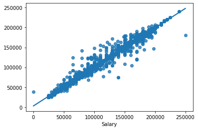
    


# 9. Model Evaluation by User Input 📊🔍👤

### 9.1 User Input


```python
sample_data  = [25,'Male','PhD','Junior Data Scientist',2,'Canada','Asian']
```

### 9.2 Preprocessing user input


```python
sample_test_data = pd.DataFrame([sample_data],columns =['Age','Gender','Education Level','Job Title','Years of Experience','Country','Race'])
sample_test_encoded = encoder.transform(sample_test_data[['Gender','Job Title','Education Level','Country','Race']])
sample_test_encoded_df = pd.DataFrame(sample_test_encoded.toarray(),columns=encoder.get_feature_names(['Gender','Job Title','Education Level','Country','Race']))
sample_selected_columns_df = sample_test_data[['Age','Years of Experience']]
sample_test_df = pd.concat([sample_selected_columns_df,sample_test_encoded_df], axis=1)
```


```python
sample_test_df
```


<div>
<style scoped>
    .dataframe tbody tr th:only-of-type {
        vertical-align: middle;
    }

    .dataframe tbody tr th {
        vertical-align: top;
    }

    .dataframe thead th {
        text-align: right;
    }
</style>
<table border="1" class="dataframe">
  <thead>
    <tr style="text-align: right;">
      <th></th>
      <th>Age</th>
      <th>Years of Experience</th>
      <th>Gender_Female</th>
      <th>Gender_Male</th>
      <th>Gender_Other</th>
      <th>Job Title_Account Manager</th>
      <th>Job Title_Accountant</th>
      <th>Job Title_Administrative Assistant</th>
      <th>Job Title_Back end Developer</th>
      <th>Job Title_Business Analyst</th>
      <th>...</th>
      <th>Race_African American</th>
      <th>Race_Asian</th>
      <th>Race_Australian</th>
      <th>Race_Black</th>
      <th>Race_Chinese</th>
      <th>Race_Hispanic</th>
      <th>Race_Korean</th>
      <th>Race_Mixed</th>
      <th>Race_Welsh</th>
      <th>Race_White</th>
    </tr>
  </thead>
  <tbody>
    <tr>
      <th>0</th>
      <td>25</td>
      <td>2</td>
      <td>0.0</td>
      <td>1.0</td>
      <td>0.0</td>
      <td>0.0</td>
      <td>0.0</td>
      <td>0.0</td>
      <td>0.0</td>
      <td>0.0</td>
      <td>...</td>
      <td>0.0</td>
      <td>1.0</td>
      <td>0.0</td>
      <td>0.0</td>
      <td>0.0</td>
      <td>0.0</td>
      <td>0.0</td>
      <td>0.0</td>
      <td>0.0</td>
      <td>0.0</td>
    </tr>
  </tbody>
</table>
<p>1 rows × 185 columns</p>
</div>


### 9.3 Feeding the input to trained model


```python
sample_prediction = rfr.predict(sample_test_df)
```


```python
print("The predicted salary for this individual is : ${:,.2f}".format(round(sample_prediction.item(),2)))
```

    The predicted salary for this individual is : $73,692.88
    

# 10 Conclusions 📝🔍

### &#x1F680;From the EDA, we can bring out these conclusions : 

#### &#x1F449; As the Age increases, the salary falls into the higher side of spectrum #### 

#### &#x1F449; "Other" gender earns more than the Male & Female #### 

#### &#x1F449; PhD holders earn more than any other Education level followed by Master's#### 

#### &#x1F449; Surprisingly people with "other" gender holding Master's earn approx. equal to Males & Females holding PhD #### 

#### &#x1F449; CEO's , CTO's , CDO's, Director of Data Science & Director are the top 5 most earning professions #### 

#### &#x1F449; The top 4 most earning postions are dominated by Males while the Females make their entry as Director of Data science #### 

### &#x1F680;From the Trained Model, we can bring out these conclusions : 

#### &#x1F449; Mean Absolute Error (MAE) : 3742.95 #### 

#### &#x1F449; Root Mean Squared Error (RMSE) : 8103.38 #### 

#### &#x1F449; Distribution plot between the test data & predictions shows high co-relation #### 

#### &#x1F449; Testing with sample user data evaluates the preprocessing of encoder as well as the trained model's prediction capability #### 

# 11. Next Steps ➡️🔜

#### &#x1F449; Creating a front end Web app using Flask or Streamlit framework #### 

#### &#x1F449; Deploying the Web App #### 
